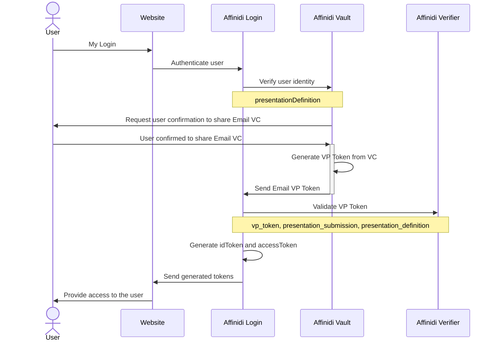

# Affinidi Login (without Identity Provider)

The Affinidi reference application uses a custom `NextAuth.js` provider to connect to Affinidi directly. It is the easiest way to get started with Affinidi Login.



> You may want to install [an extension](https://marketplace.visualstudio.com/items?itemName=bierner.markdown-mermaid) to view Mermaid diagrams.

## Set up your Affinidi Login configuration

1. Follow [this guide](./setup-login-config.md) to set up your login configuration, redirect URL as `http://localhost:3000/api/auth/callback/affinidi` and below is sample PEX

2. Copy your **Client ID**, **Client Secret** and **Issuer** from your login configuration and paste them into your `.env` file:

```ini
PROVIDER_CLIENT_ID="<CLIENT_ID>"
PROVIDER_CLIENT_SECRET="<CLIENT_SECRET>"
PROVIDER_ISSUER="<ISSUER_URL>"
```

PEX For email 
```
{
  "id": "vp_token_with_email_vc",
  "input_descriptors": [
    {
      "id": "email_vc",
      "name": "Email VC",
      "purpose": "Check if VC data contains necessary fields",
      "constraints": {
        "fields": [
          {
            "path": [
              "$.type"
            ],
            "purpose": "Check if VC type is correct",
            "filter": {
              "type": "array",
              "pattern": "Email"
            }
          },
          {
            "path": [
              "$.credentialSubject.email"
            ],
            "purpose": "Check if VC contains email field",
            "filter": {
              "type": "string"
            }
          },
          {
            "path": [
              "$.issuer"
            ],
            "purpose": "Check if VC Issuer is Trusted",
            "filter": {
              "type": "string",
              "pattern": "^did:key:zQ3shtMGCU89kb2RMknNZcYGUcHW8P6Cq3CoQyvoDs7Qqh33N"
            }
          }
        ]
      }
    }
  ]
}
```

PEX For email 
```
[
  {
    "sourceField": "$.type",
    "idTokenClaim": "$.custom[0].type",
    "inputDescriptorId": "email_vc"
  },
  {
    "sourceField": "$.credentialSubject.email",
    "idTokenClaim": "$.custom[1].email",
    "inputDescriptorId": "email_vc"
  },
  {
    "sourceField": "$.issuer",
    "idTokenClaim": "$.custom[2].issuer",
    "inputDescriptorId": "email_vc"
  }
]
```